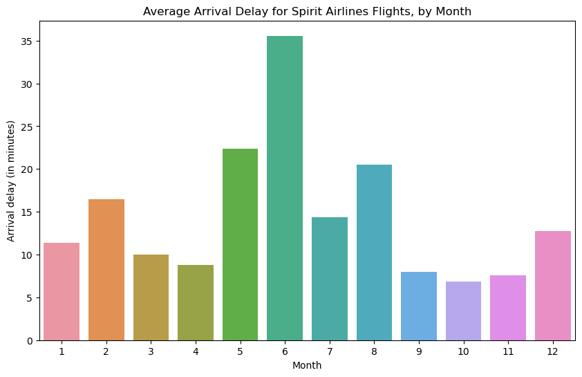
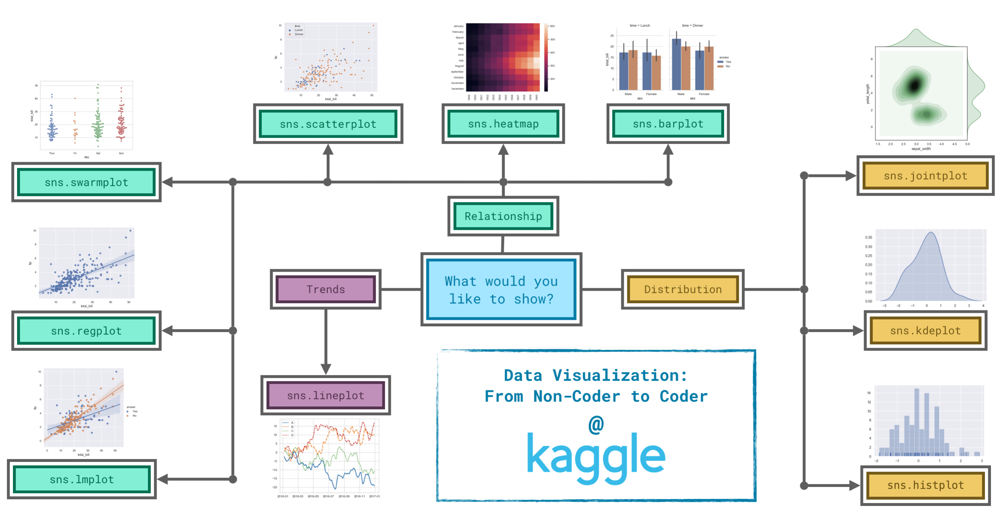

# DATA VISUALISATION

**Table des matières**
*******
 1. [Introduction](#Introduction)
 2. [Linechart](#Linechart)
 3. [Bar Charts and Heatmaps](#BarChartsandHeatmaps)
 4. [Scatter Plots](#ScatterPlots)
 5. [Distributions](#Distributions)
 6. [Choosing Plot Types and Custom Styles](#choosing)
 
 

*******


<div id='Introduction'/>

## I) **Introduction**

### 1) **Setup**

```
import pandas as pd
pd.plotting.register_matplotlib_converters()
import matplotlib.pyplot as plt
%matplotlib inline
import seaborn as sns
print("Setup Complete")
```

### 2) **Load data**


### 3) **Plot the data**
    
```
# Set the width and height of the figure
plt.figure(figsize=(16,6))
# Line chart showing how FIFA rankings evolved over time 
sns.lineplot(data=fifa_data)
```
<div id='Linechart'/>

## II) **Line Charts**

All data :

```
sns.lineplot(data=spotify_data)
```

Specific :
```
# Line chart showing daily global streams of 'Shape of You'
sns.lineplot(data=spotify_data['Shape of You'], label="Shape of You")
```

### 1) **Examine the Data**

- df.head() : show the first 5 rows of the dataset
- df.tail() : show the last 5 rows of the dataset
- df.describe() : show the summary statistics for the numerical columns in the dataset
- df.info() : show the index, datatype and memory information

### 2) **Plot the data**

- plt.figure(figsize=(width, heigh)) : create a figure
- plt.title() : set the title of the plot
- sns.lineplot(data=data, x="column1", y="column2") : create a line chart

### 3) **Plot a subset of the data**

- list(df.columns) : get the list of columns of the dataframe
- plt.xlabel() : set the label of the x-axis (horizontal axis)

<div id = 'BarChartsandHeatmaps'/>

## III) **Bar Charts and Heatmaps**


### 1) **Select a dataset**

#### a) **Load the data**

```
# Path of the file to read
flight_filepath = "../input/flight_delays.csv"
# Read the file into a variable flight_data
flight_data = pd.read_csv(flight_filepath, index_col="Month")
```

- The filepath for the dataset (in this case, flight_filepath)
- The name of the column that will be used to index the rows (in this case, index_col="Month").

#### b) **Examine the data**

```
# Print the data
flight_data
```

### 2) **Bar charts**

```
# Set the width and height of the figure
plt.figure(figsize=(10,6))

# Add title
plt.title("Average Arrival Delay for Spirit Airlines Flights, by Month")

# Bar chart showing average arrival delay for Spirit Airlines flights by month
sns.barplot(x=flight_data.index, y=flight_data['NK'])
H
# Add label for vertical axis
plt.ylabel("Arrival delay (in minutes)")
```

- ***sns.barplot*** : This tells the notebook that we want to create a bar chart.
- x=flight_data.index : This determines what to use on the ***horizontal axis***.  
In this case, we have selected the column that indexes the rows (in this case, the column containing the months).
- y=flight_data['NK'] : This sets the column in the data that will be used to determine the*** height of each bar***.  
In this case, we select the 'NK' column.



### 3) **Heatmaps**

```
# Set the width and height of the figure
plt.figure(figsize=(14,7))

# Add title
plt.title("Average Arrival Delay for Each Airline, by Month")

# Heatmap showing average arrival delay for each airline by month
sns.heatmap(data=flight_data, annot=True)

# Add label for horizontal axis
plt.xlabel("Airline")
```

- sns.heatmap : This tells the notebook that we want to ***create a heatmap***.
- data=flight_data : This tells the notebook to use all of the entries in flight_data to create the heatmap.
- annot=True : This ensures that the ***values for each cell appear on the chart***. (Leaving this out removes the numbers from each of the cells!)


<div id='ScatterPlots'/>

## IV) **Scatter Plots**

```
# Path of the file to read
insurance_filepath = "../input/insurance.csv"
# Read the file into a variable insurance_data
insurance_data = pd.read_csv(insurance_filepath)
```

### 1) **Simple scatter plots**

To create a simple scatter plot, we use the ***sns.scatterplot*** command and specify the values for:

- The ***horizontal x-axis*** (x=insurance_data['bmi']), and
- The ***vertical y-axis*** (y=insurance_data['charges']).

```
sns.scatterplot(x=insurance_data['bmi'], y=insurance_data['charges'])
```


### 2) **regression line**
***sns.regplot***
- x : the x-axis
- y : the y-axis
```
sns.regplot(x=insurance_data['bmi'], y=insurance_data['charges'])
```

### 3) **Color-coded scatter plots**

We can use scatter plots to ***display the relationships between three variables***! One way of doing this is by color-coding the points.

For instance, to understand how smoking affects the relationship between BMI and insurance costs, we can color-code the points by 'smoker', and plot the other two columns ('bmi', 'charges') on the axes.

```
sns.scatterplot(x=insurance_data['bmi'], y=insurance_data['charges'], hue=insurance_data['smoker'])
```


### 4) **Double regression line**

***sns.lmplot*** command to add ***two regression lines***, corresponding to smokers and nonsmokers.

```
sns.lmplot(x="bmi", y="charges", hue="smoker", data=insurance_data)
```

The sns.lmplot command above works slightly differently than the commands you have learned about so far:

- Instead of setting x=insurance_data['bmi'] to select the 'bmi' column in insurance_data, we set x="bmi" to ***specify the name of the column only***.
- Similarly, y="charges" and hue="smoker" also contain ***the names of columns***.
- We ***specify the dataset with data=insurance_data***.


### 5) **Categorical scatter plot**

***sns.swarmplot***

```
sns.swarmplot(x=insurance_data['smoker'],
              y=insurance_data['charges'])
```

Shows :
- On average, non-smokers are charged less than smokers
- The customers who pay the most are smokers; whereas the customers who pay the least are non-smokers.


<div id ='Distributions'/>

## V) **Distributions**

```
# Path of the file to read
iris_filepath = "../input/iris.csv"
# Read the file into a variable iris_data
iris_data = pd.read_csv(iris_filepath, index_col="Id")
# Print the first 5 rows of the data
iris_data.head()
```

### 1) **Histograms**

Say we would like to create a histogram to see how petal length varies in iris flowers. We can do this with the ***sns.histplot*** command.

```
# Histogram 
sns.histplot(iris_data['Petal Length (cm)'])
```


### 2) **Density plots**

Useful when you have a ***large dataset*** and want to ***visualize the underlying distribution*** without resorting to binning (as in histograms), which can sometimes lead to loss of information.  
Unlike histograms, KDE plots provide a ***smooth curve*** that helps in identifying patterns and trends in the data.

- To make a KDE plot, we use the sns.kdeplot command.
- Setting shade=True colors the area below the curve (and data= chooses the column we would like to plot).

```
# KDE plot 
sns.kdeplot(data=iris_data['Petal Length (cm)'], shade=True)
```


### 3) **2D KDE plots**

We're not restricted to a single column when creating a KDE plot.  
We can create a two-dimensional (2D) KDE plot with the sns.jointplot command.

```
# 2D KDE plot
sns.jointplot(x=iris_data['Petal Length (cm)'], y=iris_data['Sepal Width (cm)'], kind="kde")
```


- The curve at the top of the figure is a KDE plot for the data on the x-axis (in this case, iris_data['Petal Length (cm)']).
- The curve on the right of the figure is a KDE plot for the data on the y-axis (in this case, iris_data['Sepal Width (cm)']).

### 4) **Color Coded Plots**

We can create three different histograms (one for each species) of petal length by using the sns.histplot command (as above).

- ***data=*** provides the name of the variable that we used to read in the data
- ***x=*** sets the name of column with the data we want to plot
- ***hue=*** sets the column we'll use to split the data into different histograms

```
# Histograms for each species
sns.histplot(data=iris_data, x='Petal Length (cm)', hue='Species')
# Add title
plt.title("Histogram of Petal Lengths, by Species")
```


#### KDE plot for each species by using sns.kdeplot (as above).

```
# KDE plots for each species
sns.kdeplot(data=iris_data, x='Petal Length (cm)', hue='Species', shade=True)

# Add title
plt.title("Distribution of Petal Lengths, by Species")
```


<div id='choosing' />

## VI) **Choosing Plot Types and Custom Styles**



***Trends*** - A trend is defined as a pattern of change.
- ***sns.lineplot*** - Line charts are best to show trends over a period of time, and multiple lines can be used ***to show trends in more than one group***.

***Relationship*** - There are many different chart types that you can use to understand relationships between variables in your data.
- ***sns.barplot*** - Bar charts are useful for ***comparing quantities corresponding to different groups***.
- ***sns.heatmap*** - Heatmaps can be used to find ***color-coded patterns in tables of numbers***.
- ***sns.scatterplot*** - Scatter plots show the ***relationship between two continuous variables***; if color-coded, we can also show the relationship with a third categorical variable.
- ***sns.regplot*** - Including a ***regression line*** in the scatter plot makes it easier to see any ***linear relationship between two variables***.
- ***sns.lmplot*** - This command is useful for drawing ***multiple regression lines***, if the scatter plot contains multiple, color-coded groups.
- ***sns.swarmplot*** - Categorical scatter plots show the ***relationship between a continuous variable and a categorical variable***.

***Distribution*** - We visualize distributions to show the possible values that we can expect to see in a variable, along with how likely they are.

- ***sns.histplot*** - Histograms show the distribution of a ***single numerical variable***.
- ***sns.kdeplot*** - KDE plots (or 2D KDE plots) show an estimated, smooth distribution of a ***single numerical variable (or two numerical variables)***.
- ***sns.jointplot*** - This command is useful for simultaneously displaying a 2D KDE plot with the corresponding KDE plots for each individual variable.

### **Changing styles with seaborn**

***sns.set_style("dark")***

```
# Change the style of the figure to the "dark" theme
sns.set_style("dark")

# Line chart 
plt.figure(figsize=(12,6))
sns.lineplot(data=spotify_data)
```

Seaborn has five different themes: 
- (1)"darkgrid"
- (2)"whitegrid"
- (3)"dark"
- (4)"white"
- (5)"ticks"