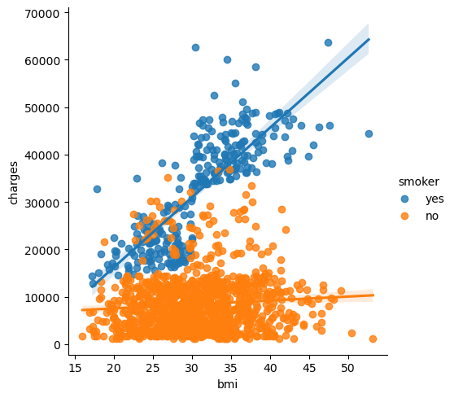

# DATA VISUALISATION

## I) **Introduction**

### 1) **Setup**

```
import pandas as pd
pd.plotting.register_matplotlib_converters()
import matplotlib.pyplot as plt
%matplotlib inline
import seaborn as sns
print("Setup Complete")
```

### 2) **Load data**


### 3) **Plot the data**
    
```
# Set the width and height of the figure
plt.figure(figsize=(16,6))
# Line chart showing how FIFA rankings evolved over time 
sns.lineplot(data=fifa_data)
```

## II) **Line Charts**

All data :

```
sns.lineplot(data=spotify_data)
```

Specific :
```
# Line chart showing daily global streams of 'Shape of You'
sns.lineplot(data=spotify_data['Shape of You'], label="Shape of You")
```

### 1) **Examine the Data**

- df.head() : show the first 5 rows of the dataset
- df.tail() : show the last 5 rows of the dataset
- df.describe() : show the summary statistics for the numerical columns in the dataset
- df.info() : show the index, datatype and memory information

### 2) **Plot the data**

- plt.figure(figsize=(width, heigh)) : create a figure
- plt.title() : set the title of the plot
- sns.lineplot(data=data, x="column1", y="column2") : create a line chart

### 3) **Plot a subset of the data**

- list(df.columns) : get the list of columns of the dataframe
- plt.xlabel() : set the label of the x-axis (horizontal axis)

## III) **Bar Charts and Heatmaps**


### 1) **Select a dataset**

#### a) **Load the data**

```
# Path of the file to read
flight_filepath = "../input/flight_delays.csv"
# Read the file into a variable flight_data
flight_data = pd.read_csv(flight_filepath, index_col="Month")
```

- The filepath for the dataset (in this case, flight_filepath)
- The name of the column that will be used to index the rows (in this case, index_col="Month").

#### b) **Examine the data**

```
# Print the data
flight_data
```

### 2) **Bar charts**

```
# Set the width and height of the figure
plt.figure(figsize=(10,6))

# Add title
plt.title("Average Arrival Delay for Spirit Airlines Flights, by Month")

# Bar chart showing average arrival delay for Spirit Airlines flights by month
sns.barplot(x=flight_data.index, y=flight_data['NK'])
H
# Add label for vertical axis
plt.ylabel("Arrival delay (in minutes)")
```

- ***sns.barplot*** : This tells the notebook that we want to create a bar chart.
- x=flight_data.index : This determines what to use on the ***horizontal axis***.  
In this case, we have selected the column that indexes the rows (in this case, the column containing the months).
- y=flight_data['NK'] : This sets the column in the data that will be used to determine the*** height of each bar***.  
In this case, we select the 'NK' column.


### 3) **Heatmaps**

```
# Set the width and height of the figure
plt.figure(figsize=(14,7))

# Add title
plt.title("Average Arrival Delay for Each Airline, by Month")

# Heatmap showing average arrival delay for each airline by month
sns.heatmap(data=flight_data, annot=True)

# Add label for horizontal axis
plt.xlabel("Airline")
```

- sns.heatmap : This tells the notebook that we want to ***create a heatmap***.
- data=flight_data : This tells the notebook to use all of the entries in flight_data to create the heatmap.
- annot=True : This ensures that the ***values for each cell appear on the chart***. (Leaving this out removes the numbers from each of the cells!)


## IV) **Scatter Plots**

```
# Path of the file to read
insurance_filepath = "../input/insurance.csv"
# Read the file into a variable insurance_data
insurance_data = pd.read_csv(insurance_filepath)
```

### 1) **Simple scatter plots**

To create a simple scatter plot, we use the ***sns.scatterplot*** command and specify the values for:

- The ***horizontal x-axis*** (x=insurance_data['bmi']), and
- The ***vertical y-axis*** (y=insurance_data['charges']).

```
sns.scatterplot(x=insurance_data['bmi'], y=insurance_data['charges'])
```


### 2) **regression line**
***sns.regplot***
- x : the x-axis
- y : the y-axis
```
sns.regplot(x=insurance_data['bmi'], y=insurance_data['charges'])
```

### 3) **Color-coded scatter plots**

We can use scatter plots to ***display the relationships between three variables***! One way of doing this is by color-coding the points.

For instance, to understand how smoking affects the relationship between BMI and insurance costs, we can color-code the points by 'smoker', and plot the other two columns ('bmi', 'charges') on the axes.

```
sns.scatterplot(x=insurance_data['bmi'], y=insurance_data['charges'], hue=insurance_data['smoker'])
```


### 4) **Double regression line**

***sns.lmplot*** command to add ***two regression lines***, corresponding to smokers and nonsmokers.

```
sns.lmplot(x="bmi", y="charges", hue="smoker", data=insurance_data)
```

The sns.lmplot command above works slightly differently than the commands you have learned about so far:

- Instead of setting x=insurance_data['bmi'] to select the 'bmi' column in insurance_data, we set x="bmi" to ***specify the name of the column only***.
- Similarly, y="charges" and hue="smoker" also contain ***the names of columns***.
- We ***specify the dataset with data=insurance_data***.



### 5) **Categorical scatter plot**

***sns.swarmplot***

```
sns.swarmplot(x=insurance_data['smoker'],
              y=insurance_data['charges'])
```

Shows :
- On average, non-smokers are charged less than smokers
- The customers who pay the most are smokers; whereas the customers who pay the least are non-smokers.


## V) **Distributions**

### 1) **Histograms**

### 2) **Density plots**

### 3) **2D KDE plots**

### 4) **Color Coded Plots**